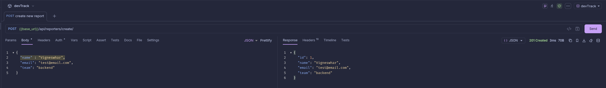
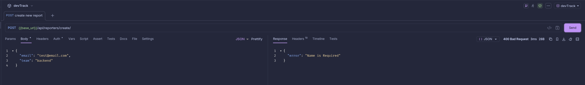
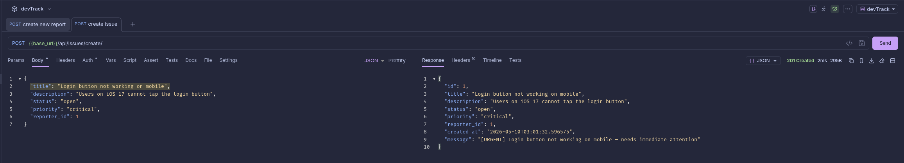
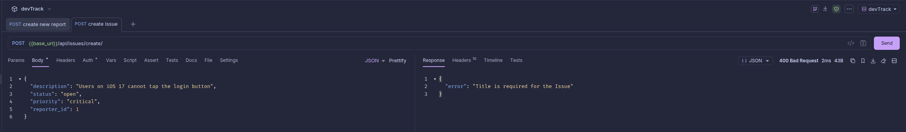

# DevTrack

A issue tracking REST API built with Django and Django REST Framework. Supports creating and managing reporters and issues, backed by JSON file storage.

## How to Run

**1. Create and activate a virtual environment**
```bash
python -m venv venv
source venv/bin/activate
```

**2. Install dependencies**
```bash
pip install django djangorestframework
```

**3. Create the data files**
```bash
mkdir data
echo "[]" > data/reporters.json
echo "[]" > data/issues.json
```

**4. Start the server**
```bash
python manage.py runserver
```

The API will be available at `http://127.0.0.1:8000`.

---

## API Endpoints

### Reporters

| Method | Endpoint | Description |
|--------|----------|-------------|
| POST | `/api/reporters/create/` | Create a new reporter |
| GET | `/api/reporters/all/` | Get all reporters |
| GET | `/api/reporters/?id=1` | Get a reporter by ID |

**POST `/api/reporters/create/`**
```json
{
  "name": "Alice",
  "email": "alice@example.com",
  "team": "backend"
}
```

---

### Issues

| Method | Endpoint | Description |
|--------|----------|-------------|
| POST | `/api/issues/create/` | Create a new issue |
| GET | `/api/issues/all/` | Get all issues |
| GET | `/api/issues/?id=1` | Get an issue by ID |

**POST `/api/issues/create/`**
```json
{
  "title": "Login bug",
  "description": "Users cannot login with Google",
  "status": "open",
  "priority": "high",
  "reporter_id": 1
}
```

Valid values:
- `status`: `open`, `in_progress`, `resolved`, `closed`
- `priority`: `low`, `medium`, `high`, `critical`

Both `status` and `priority` are optional — they default to `open` and `low` respectively.

---

## Screenshots

Place your screenshots inside a `docs/screenshots/` folder at the project root, then they will display here.

**Success — Create Reporter (201)**



**Failure — Missing Title (400)**



**Success — Create Issue (201)**



**Failure — Issue Without Title (400)**



---

## Design Decision: Shared File I/O and ID Generation on `BaseEntity`

All entities (`Reporter`, `Issue`) extend a `BaseEntity` abstract class. Rather than duplicating file read/write logic and ID generation in every view, three class methods were added directly to `BaseEntity`:

```python
BaseEntity.read_all(file_path)       # reads and parses the JSON file
BaseEntity.save_all(file_path, data) # writes data back to the JSON file
BaseEntity.generate_id(data)         # returns len(data) + 1 as the next ID
```

This means every subclass inherits these for free without any extra code. Views call `Issue.read_all(...)` or `Reporter.save_all(...)` directly — the logic lives in one place and any future entity gets it automatically by extending `BaseEntity`.
